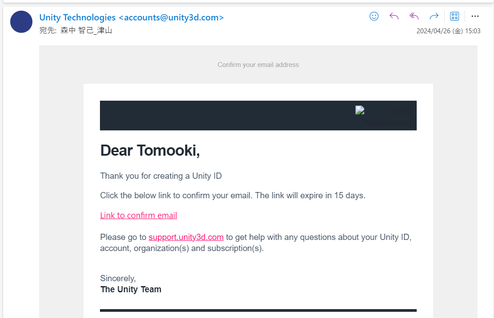

# アカウントをつくる
UnityHubを起動しましょう  
起動するとたぶん、こんな感じの画面でしょう。  

  
  
アカウントがないと思うので【Create account】を押しましょう  
するとブラウザが開いて、以下の画面がでます。  

  
    
    
必要な情報を入力していきます。  
E-mailには用意してもらった任意のメールアドレスを入れてください。画像ではテキトーに学校のやつをいれました  
パスワードは頑張って考えてくださいね。Bitwardenというパスワードマネージャーおすすめです。  
FullNameですが、Unityで本格的にお金儲けをするなら本名を登録しないといけません。まぁ後から変更できたと思うので自由に  
「規則にしたがうよと」チェックをつけたら  
【Create a Unity ID】を押しましょう  
  
先ほど指定したメールアドレスにこんなメールが来るはずです。  
  
    
  
【Link to confirm email】を押しましょう。  
これでアカウントができました。以下の画面でメールアドレスとパスワードを入力してサインインできたらできる証拠です。  
  
  
  
(ここでサインインできない場合は、いろいろ原因が考えられます。一例ですけど、  
プロキシの設定が有効になっている  
パスワードをうちまちがえている  
とかですかね。謎に再起動したら直ったりもします。)