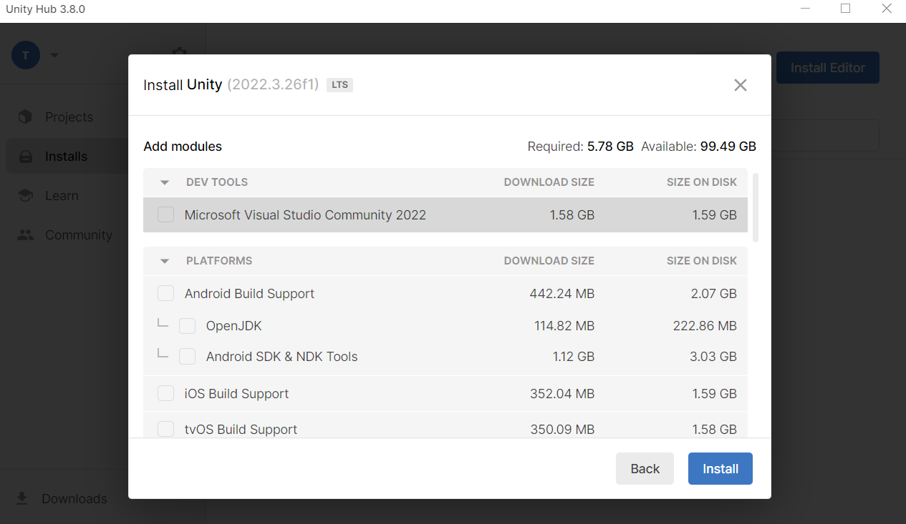
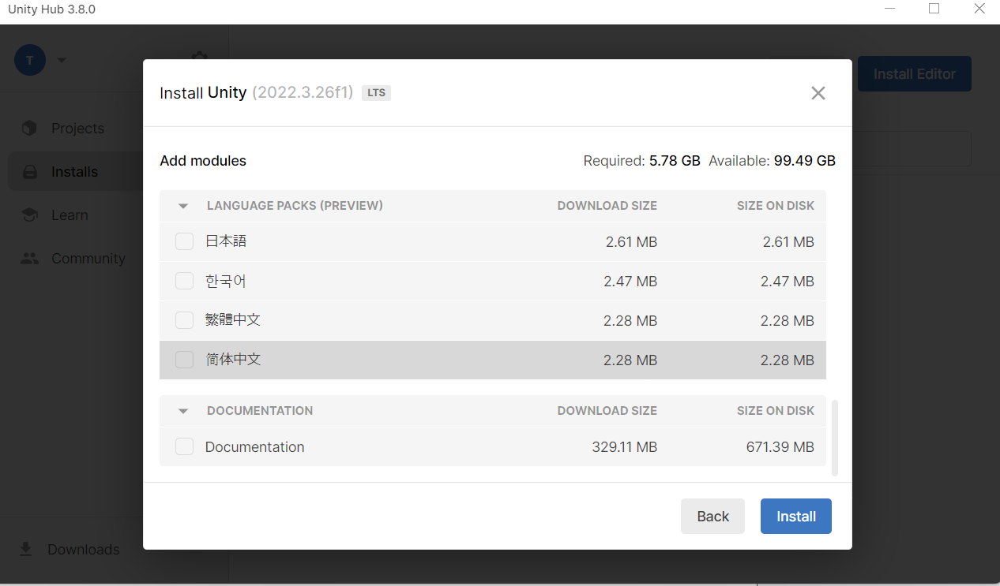
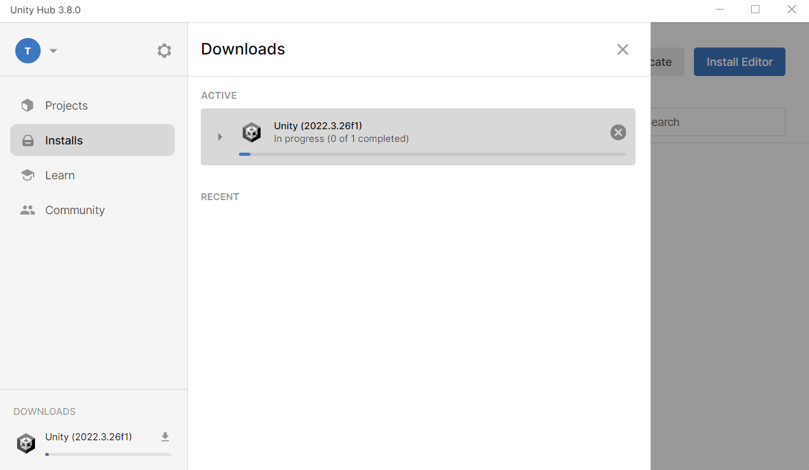

# UnityEditorをいれる
UnityEditor……Unity本体のこと(うるとら雑説明)さっきからUnityといっているものです。  
  
installsの画面で右上の【Install Editor】を押しましょう。  
  
  
  
この中のUnity(2022.3.26f1)LTSを【Install】  
(LTS…Long Time Support 現在もサポートしているって意味。つまり安定版というわけ、最新バージョンは不安定なのでオススメしない)  
  
  
  
【Install】を押すと以下の画面になります。  
モジュールを選択する画面です。  
VSCodeを使う場合はVisualStudio(VisualStudioCommunity 2022)のチェックを外します。  
はい、容量大きいポイントです。  
新入生のPCの性能が高くて結構サクサク動いてくれたため、VSCodeでなくてもいい人はチェックしたままでよいです。
  
  
  
  
UnityはiOS,Andoroid,web向けなどにビルドできます。マルチプラットフォームがUnityの良いところらしい。(Tomookiはwindows向けしかしたことがない)  
デフォルトではwindows向けのビルド(.exe)だけができます。  
今回はそれだけで十分なので「PLATFORMS」のなかのチェックマークを外しましょう。今後自分でゲームとか作るときに必要ならモジュールを追加しましょう。  
  
下のほうにスクロールすると言語パックがあります。  
日本語をいれたければ入れてください。  
個人的には公式ドキュメントや解説サイトは英語のまま説明していることが多いので、英語のまま使うのがおススメです。  
  
  
  
こんな画面になったらオッケーです。お疲れ様です。インストールされるのを待ちましょう  
VSCodeでなくてもいいなという人はこのままテトリス作るサイトに従ってテトリスをつくることができます  
https://noobtuts.com/unity    
セキュリティ的に引っかかるかもしれませんが、単純にサイトが古いだけで問題ないです。安心してね  
  

  
  