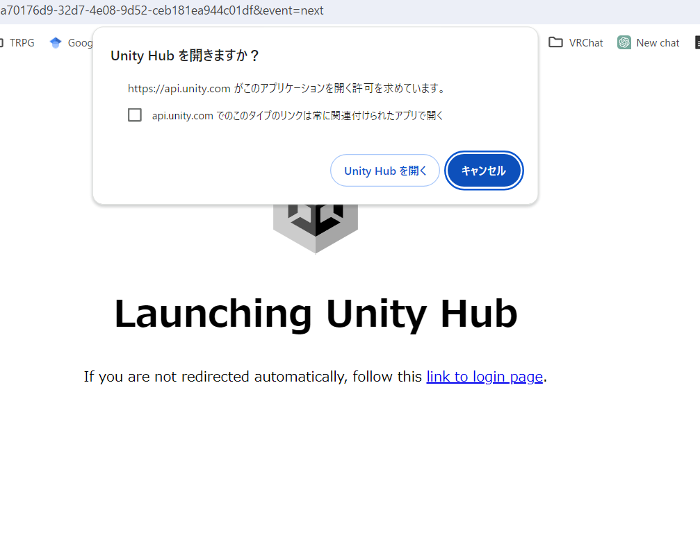

# ライセンス認証
Unityにはライセンスがいくつかあります。  
法人化どうかや、一定以上ゲームで収益をあげるかなどによってかわります。  
今回は、個人利用で高い収益が入る見込みは皆無なのでPersonalライセンスを選択する予定です。()
  
まず、UnityHubに戻ってサインインします。  
たぶん、ブラウザ上にこんな画面が出た後に【UnityHubを開く】を押すと、UnityHubにもどります。
  
  
  
で、最近に仕様が変更したのか、起動どうしたらこのポップがでます。  
このあたりのことがあまりネットのサイトに載ってませんでした。 
ライセンス取得はブラウザ上で先に獲得するか、UnityHubから申請をして獲得するものだったのですが、先に聞いてくれるようですね。やさしい  
【Agree】を押しましょう  

  
  
次に出てくるポップは「Unityをダウンロードするかい？」という内容です。  
一旦、【Skip installation】しましょう。  
(このあとの説明のために入れないでくれると助かる。  
ただ、これで入れても問題ないよ。VisualStudioが入るよ)  
  
  
  
この後に、歯車を押してLicenceを押して写真のようになっていたらオッケーです。  
  
  
  
