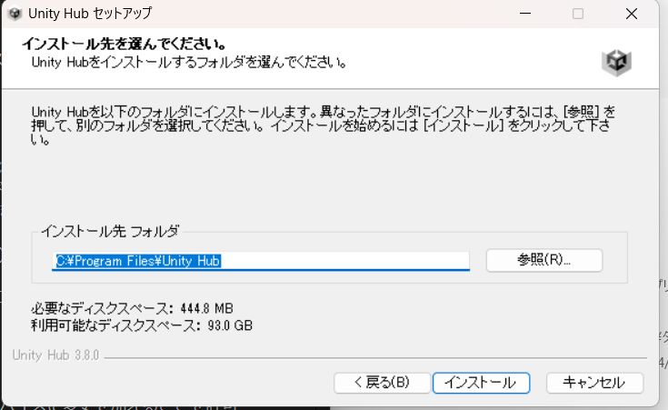

# 前置き
環境構築を始める前にこれからインストールするものがどんなものか超！簡単に説明するよ。詳しくはggr

## Unity
ユニティ。ゲームエンジンです。  
ゲームを簡単に作れるように支援してくれるツールのことです。音楽を鳴らしたり、コントローラーに対応したりとかゲームをする上で必要な機能を楽に実装できます。  ウマ娘とかUnityで作られてるそうです。  
個人利用なら無料で使えることもあって、ゲーム開発で利用する人が多いです。そのため、ネット上に情報がゴロゴロ転がっています(良い悪いはおいておいて)  
  
## VisualStudioCode
ビジュアルスタジオコード。VSCodeとよく略されます。  
Microsoftが提供する開発用エディタです  
エディタというのはWindowsの「メモ帳」とか「Word」とかテキストを編集するようなソフトのことです。  
様々な拡張機能をいれることで快適にプログラミングをすることができます。
  
## なんでVSCode?
本来、UnityはVisualStudio2019やVisualStudio2022などを推奨しています。  
でも、これがかなり重い。容量いっぱい食べます。  
VisualStudioはIDEというもので、雑にいうとソフト開発における便利機能全部乗せです  
Unity君がほぼIDEだから個人開発ならVisualStudioはちょっと過剰だと思っています。  
あと、VisualStudioとUnityの併用が学校指定PCで動くかわからん。
  
だからVSCodeをインストールする必要性があったんですね。  

  
# UnityHubのダウンロード
「Unity ダウンロード」等と検索してunity.comのダウンロードサイトにいきます。  
  

  
【Windouws用ダウンロード】を押すとUnityHubSetup.exeが手に入ります。  

それを起動！  
  
もし「このアプリがデバイスに変更を加えることを許可しますか」とでたら【はい】を押しましょう  
  

起動したらこんな画面が出ます
  
  

ライセンス契約書を読みたければ読んでください。読む人は偉いです。  
【同意する】を押します。  
  
  
  
インストール先を指定する画面です。  
自由な場所にできますが、そのままにしておくのがベターです。  
【インストール】を押します。  
  
(USBメモリなど、外部記憶媒体に保存してPC本体の容量を節約する方法があります。しかし、Unity関連はBuildなどCPUを酷使する処理をよくするのでCPUと物理的に距離が近いPC本体のストレージにいれたほうが比較的サクサクします。)  

  
しばらく待つと「UnityHubセットアップウィザードは完了しました」とでます。  
【完了】を押します。   
UnityHubを起動しましょう。