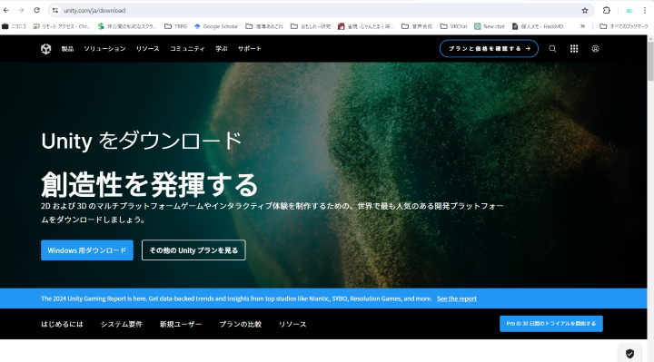
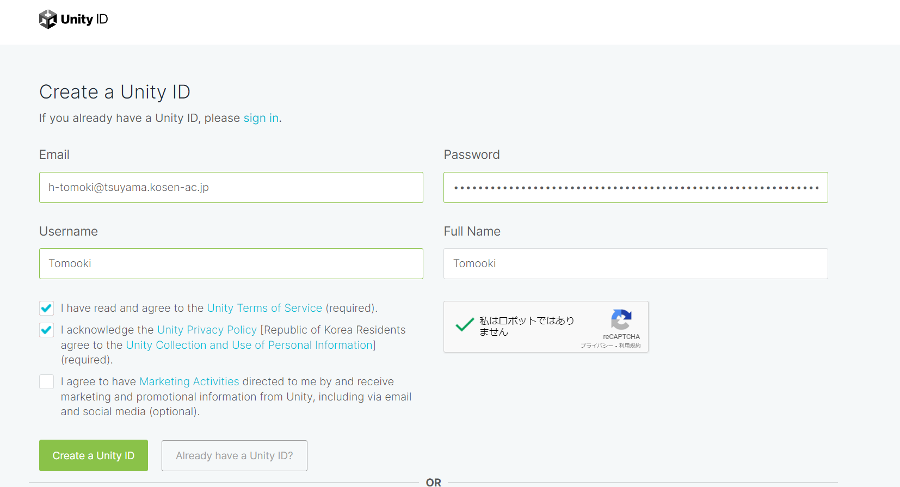
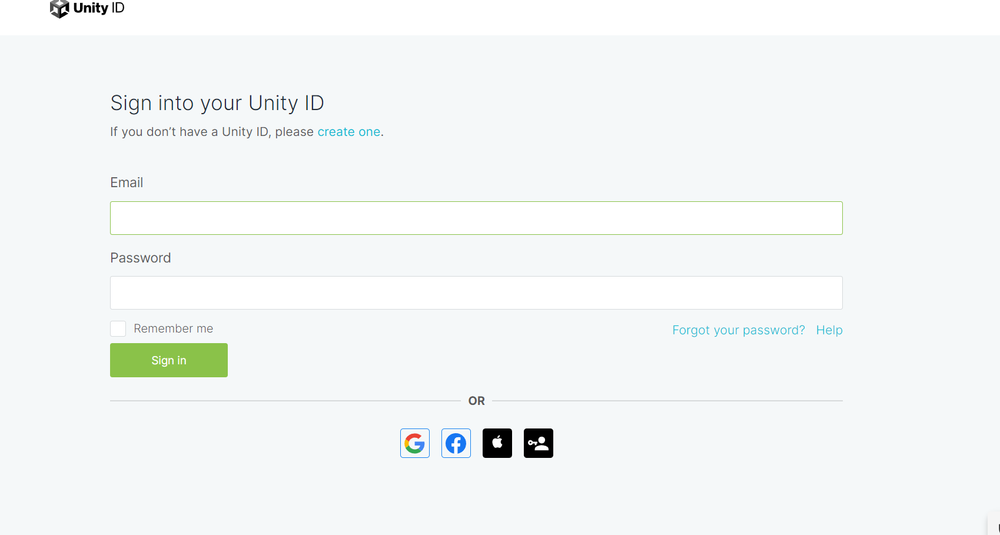

# Unityの環境構築
## UnityHubのダウンロード
「Unity ダウンロード」等と検索してunity.comのダウンロードサイトにいきます。  
  

  
【Windouws用ダウンロード】を押すとUnityHubSetup.exeが手に入ります。  

それを起動！  
  
もし「このアプリがデバイスに変更を加えることを許可しますか」とでたら【はい】を押しましょう  
  

起動したらこんな画面が出ます
  
  

ライセンス契約書を読みたければ読んでください。読む人は偉いです。  
【同意する】を押します。  
  

  
インストール先を指定する画面です。  
自由な場所にできますが、そのままにしておくのがベターです。  
【インストール】を押します。  
  
(USBメモリなど、外部記憶媒体に保存してPC本体の容量を節約する方法があります。しかし、Unity関連はBuildなどCPUを酷使する処理をよくするのでCPUと物理的に距離が近いPC本体のストレージにいれたほうが比較的サクサクします。)  

  
しばらく待つと「UnityHubセットアップウィザードは完了しました」とでます。  
【完了】を押します。  
  
UnityHubを起動しましょう。  
## アカウントをつくる
起動するとたぶん、こんな感じの画面でしょう。  

  
  
アカウントがないと思うので【Create account】を押しましょう  
するとブラウザが開いて、以下の画面がでます。  

  
    
    
必要な情報を入力していきます。  
E-mailには用意してもらった任意のメールアドレスを入れてください。画像ではテキトーに学校のやつをいれました  
パスワードは頑張って考えてくださいね。Bitwardenというパスワードマネージャーおすすめです。  
FullNameですが、Unityで本格的にお金儲けをするなら本名を登録しないといけません。まぁ後から変更できたと思うので自由に  
「規則にしたがうよと」チェックをつけたら  
【Create a Unity ID】を押しましょう  
  
先ほど指定したメールアドレスにこんなメールが来るはずです。  
  
    
  
【Link to confirm email】を押しましょう。  
これでアカウントができました。以下の画面でメールアドレスとパスワードを入力してサインインできたらできる証拠です。  
一旦、お疲れ様です。  
  
  
  
