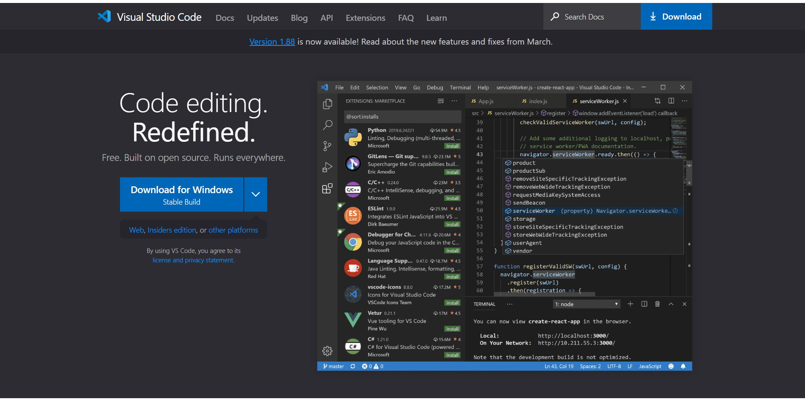
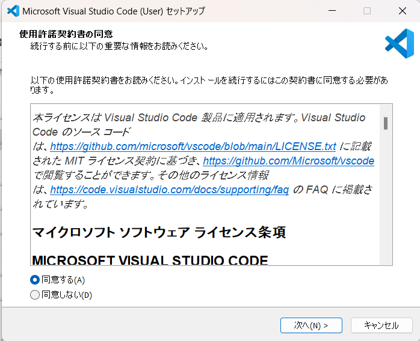
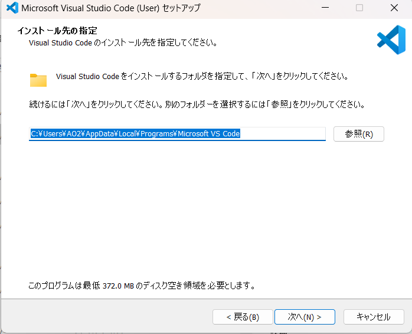
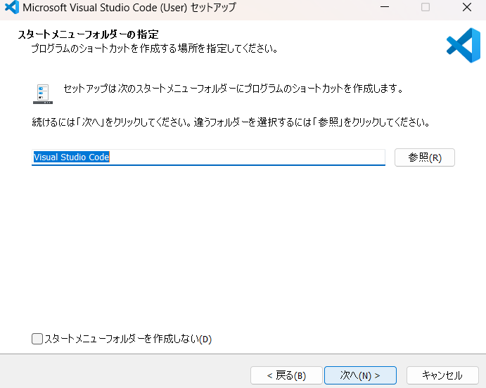
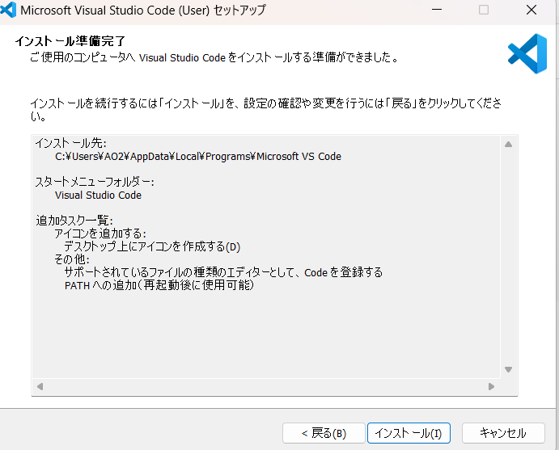
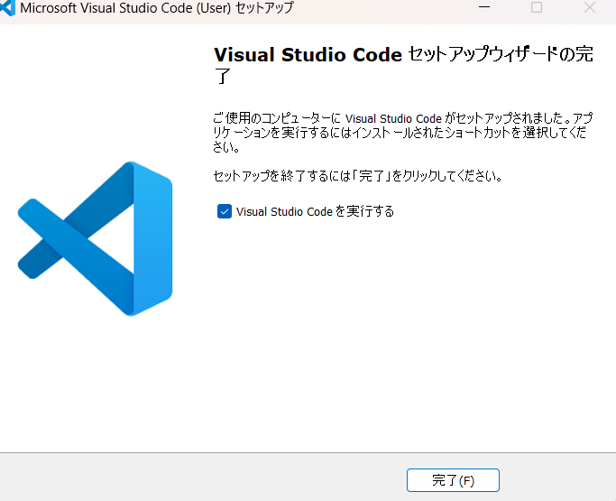

# VScodeのインストール
https://code.visualstudio.com/

にアクセスして【Download for Windows】を押します。
インストーラがダウンロードされるはずです。

ダウンロードできたらそれを起動します。

こんな画面です。規約に同意しましょう。

どんどん画面の指示に従っていきます。
保存したい場所があるならばどこでも構いませんが、やっぱりここもデフォルトのままが推奨です。

オプションを設定する画面です。
基本好みでよいですが、「PATHへの追加」は必ずチェックしてください。
そうでないといろんなところでうまく動作しなくなります（マジ）

【インストール】！！

【完了】！！

こんなかんじの画面がでたら成功です。

## 正直このサイトでできた
あとはこのサイトに従えばできますね。えぇ

過去に自分がこの環境構築をするときに参考にしたサイトを発掘できた。

ここの内容でできなかったら見てみるといいかも。あと、自分で調べてもイイかも。

いや、あの、ほんとうに雑で申し訳ない。(口頭での説明って楽なんだなと感じている)

https://dianxnao.com/unity%E3%81%AEc%E3%82%A8%E3%83%87%E3%82%A3%E3%82%BF%E3%82%92vscode%E3%81%AB%E3%81%97%E3%81%A6%E4%BD%BF%E3%81%86%E8%A8%AD%E5%AE%9A%E3%80%90windows%E7%B7%A8%E3%80%912022%E5%B9%B48%E6%9C%88/

試しに、スクリプトが書けるようなら成功です。
